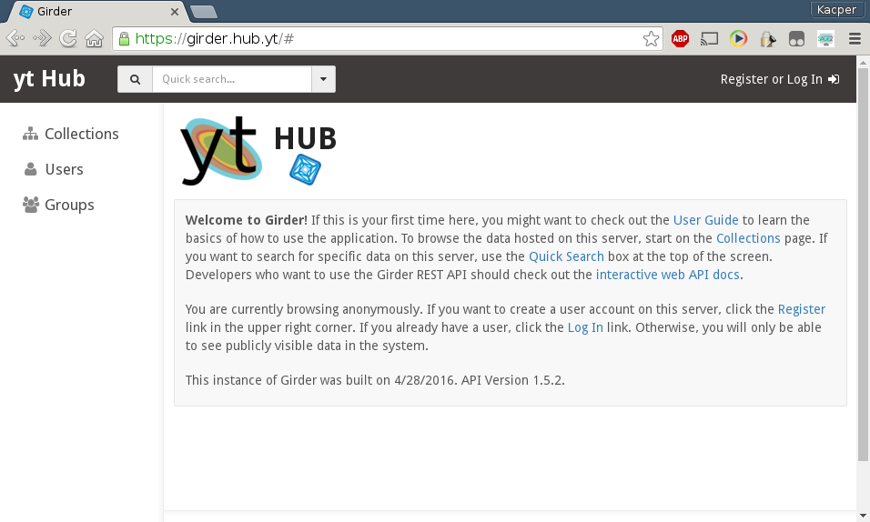
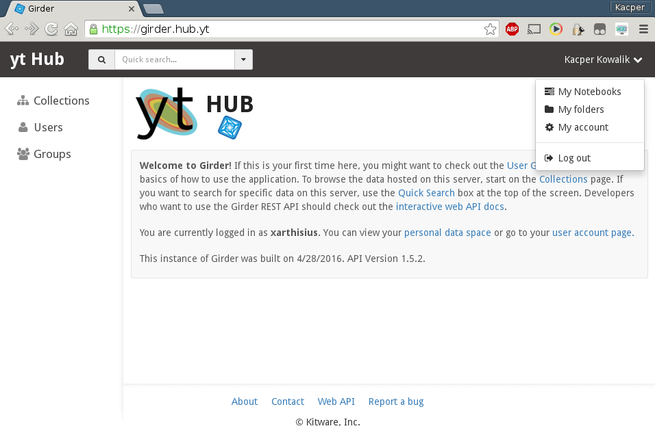
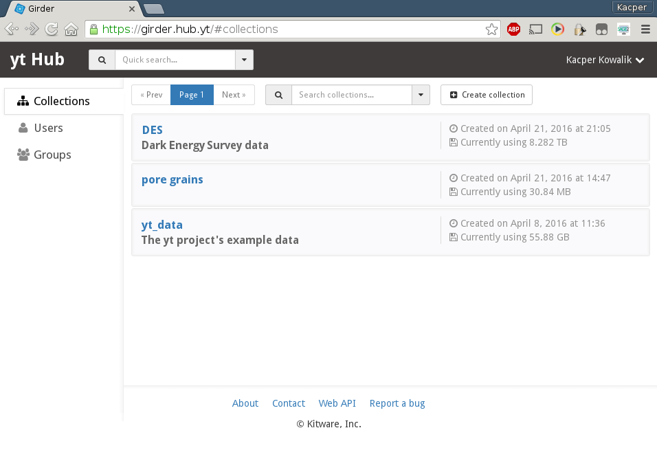

Girder 101
==========

Logging in
----------

In order to use Girder you need to log in by following the link in the upper
right corner of the main page.

    The main Girder's page

If you don't have an account yet, you can register by either creating a local
account or using OAuth with Google, GitHub or Bitbucket as provider. After a
successful login, you will be able to access your folders, notebooks and
account settings using the user menu in the upper right corner.

    
    A view of the main Girder's page for an authenticated user 

Browsing Data
-------------

You can access the data stored in Girder by following *Collections* link in the
left sidebar menu.

    
    The default collections view.
