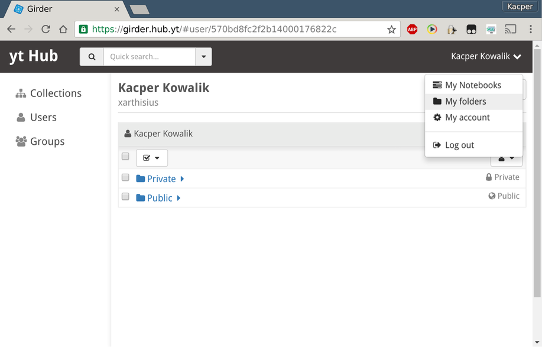
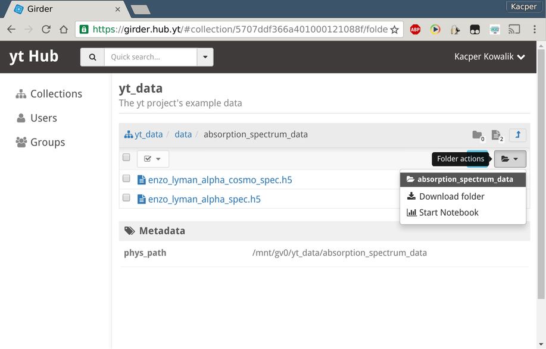
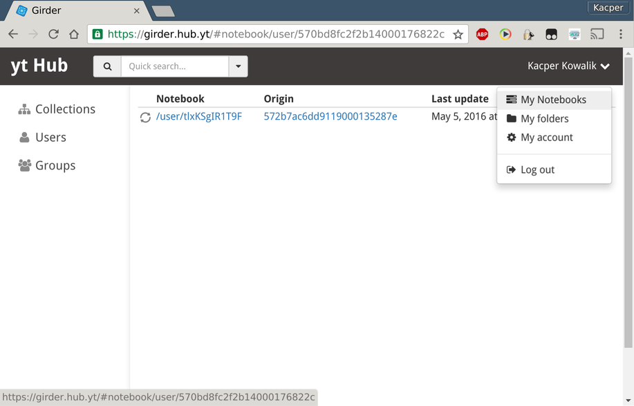
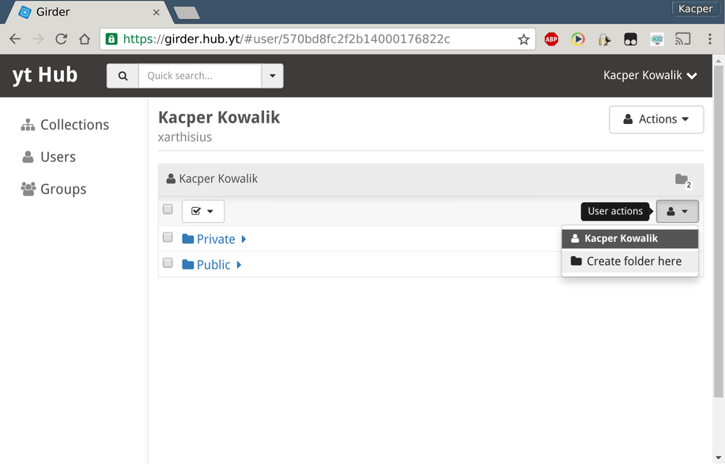
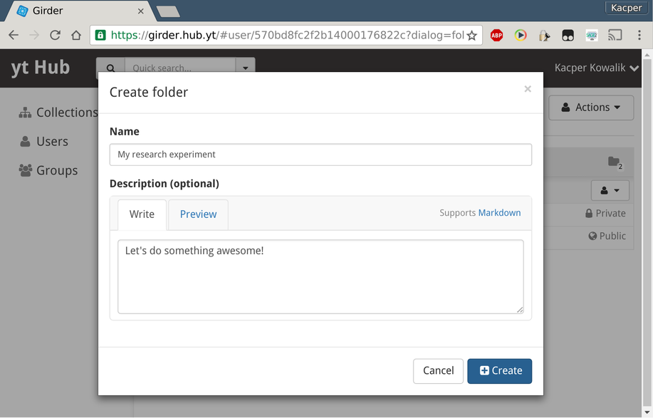
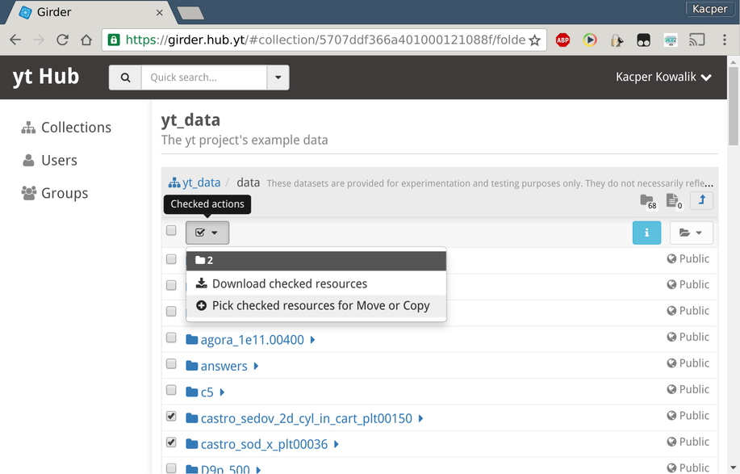
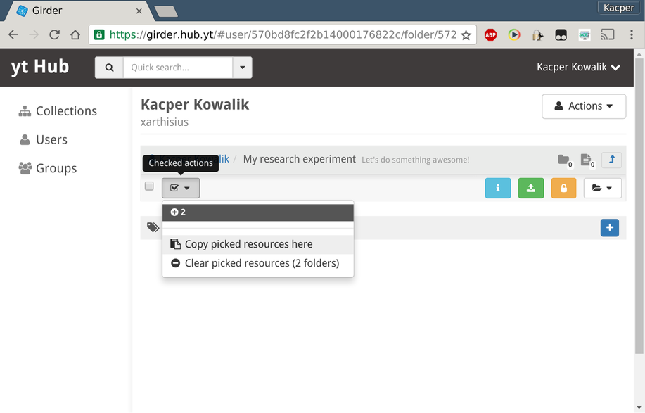
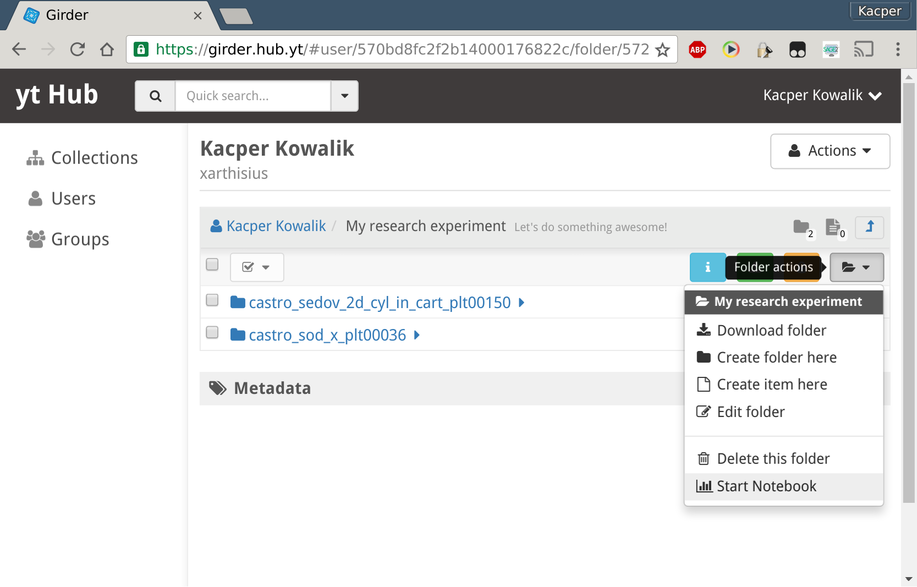
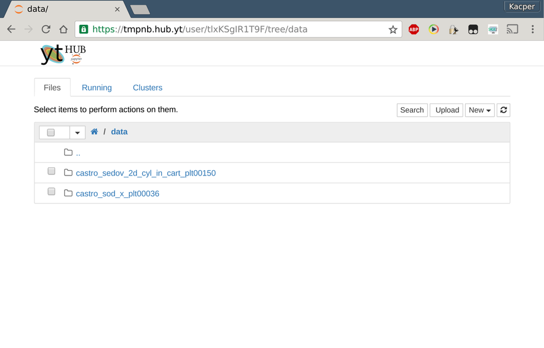

Girder 101
==========

Logging in
----------

In order to use Girder you need to log in by following the link in the upper
right corner of the main page.

.. figure::  _static/girder_mainpage.png
    :align:   center

    The main Girder's page

If you don't have an account yet, you can register by either creating a local
account or using OAuth with Google, GitHub or Bitbucket as provider. After a
successful login, you will be able to access your folders, notebooks and
account settings using the user menu in the upper right corner.

.. figure::  _static/girder_mainpage_auth.png
    :align:   center
    
    A view of the main Girder's page for an authenticated user 

Each authenticated user is provided with a free space that can be accessed via
user menu in the upper right corner and is initially populated with two folders:

 * *Public* - folder and its content is visible to all the other users, 
 * *Private* - folder and its content is visible only to you.

    
    A view showing the userspace along with a user menu in the upper right corner.

You can modify the default permissions as you see fit using the yellow *Access
Control* button.

Browsing Data
-------------

You can access the data stored in Girder by following *Collections* link on the
left sidebar menu and following tree like structure in the main view.

.. figure::  _static/girder_collections.png
    :align:   center
    
    The default collections view.

Interacting with Data
---------------------

At any place in the collection tree structure you can start `Jupyter Notebook
<http://jupyter.org/>`_ using *folder actions* menu:

    
    Folder action menu.

Once you click on a *Start Notebook* item you will be redirected to a persistent
notebook. Inside you will find all the data contained in the folder from which
you started the notebook along with the content of your girder's *Private*
folder. 

You can view all your currently running notebooks by following *My Notebooks*
from the user menu.

    
    My Notebooks list view.

Customizing Data in Notebooks
^^^^^^^^^^^^^^^^^^^^^^^^^^^^^

You can easily compose a custom dataset using the available data. In order to do
that navigate to your userspace and create a new folder using *User actions* menu
on right hand side:

       
    Creating a new folder.

Edit the name and the description of your new folder:

    Creating *My research experiment* folder.

Navigate to any collection and select folder or items using checkboxes on
left hand side. Next, select *Pick checked resources* in the *Checked actions*
menu:

    Selecting resources for a copy.

Go back to your recently created folder and again use the *Checked actions*
menu to *Copy picked resources*:

    Copying resources to the current folder.

Selecting *Start Notebook* from the *Folder actions* menu:

    Copying resources to the current folder.

will redirect you to a notebook that contains newly copied data:

    Contents of *data* directory inside the Jupyter notebook.

If you go back to the Girder's original folder, you'll notice that *Folder
actions* menu contains new items:

 * *Visit Notebook* - will redirect your browser back to the running notebook.
 * *Stop Notebook* - will gracefully shut the notebook down.

Upon stopping the notebook all ``*.ipynb`` files will be copied back to your
*Private* folder, possibly **overwriting** current files.
